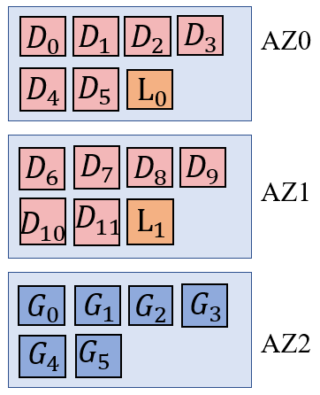
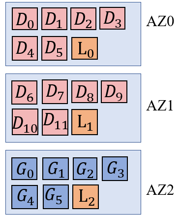
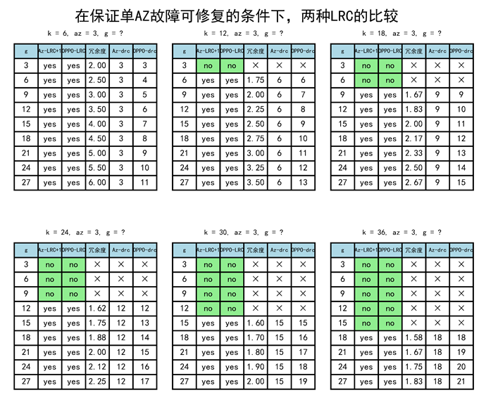
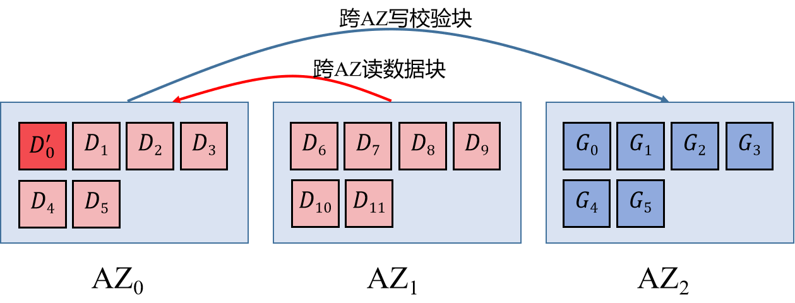
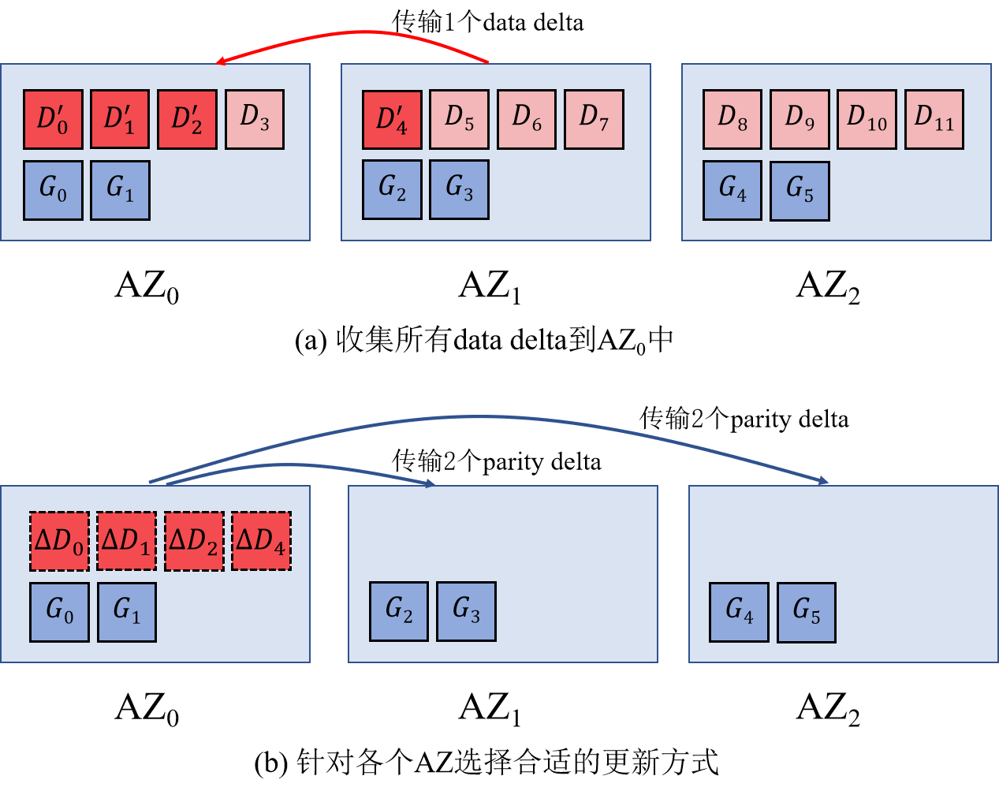
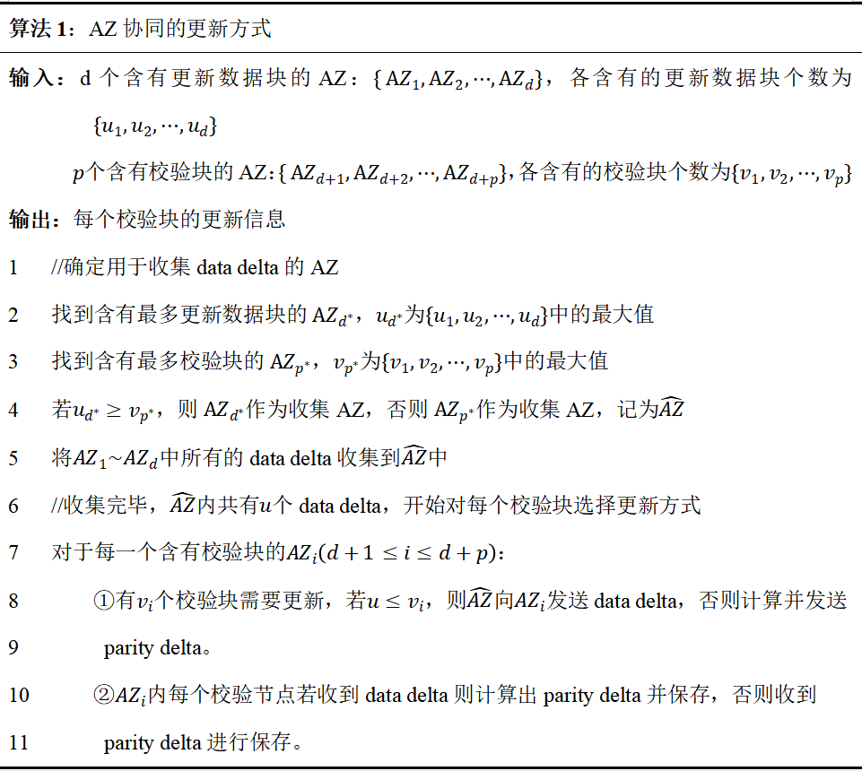

# 一、修复

# 1. 问题描述与分析

## 1.1. cubefs正在使用的编码模式

- **1AZ场景：**RS(10, 4)，冗余度为1.4， 对比三副本节约一半以上的存储成本，并且可以提供大于99.999999999%的数据耐久度。

- **3AZ场景：**

  -  RS(15, 9) ， 当某个AZ数据完全损坏，剩余16份数据可以正常恢复数据，且还能额外允许1块磁盘损坏 。

  

  -  LRC(12, 9, 3)，在AZ故障后可以额外允许任意2份数据损坏，但是其存储冗余度是2.0相对较高。

  

  -  LRC(12, 6, 3)，AZ故障后额外允许任意1块磁盘损坏，存储冗余度1.75。

  

## 1.2. cubefs编码模式面临的问题

​		RS编码，即使是单块修复也会引起大量的跨AZ流量。为了解决这个问题，cubefs实现了LRC编码，以减少单块修复的跨AZ流量。具体的做法是：先基于RS编码生成全局校验块，然后将全局校验块和数据块均匀放置到每个AZ，最后在每个AZ内部额外生成1个局部校验块。我们将cubefs的这种LRC编码策略称作OPPO_LRC。OPPO_LRC成功将单块修复的跨AZ流量降为0，但仍存在一些问题。

- （1）多块修复时，需要从每个AZ读取**原始**的数据块和全局校验块，跨AZ流量非常大。
- （2）局部校验块无法参与多块修复流程，因而产生额外的单块修复操作。例如某AZ内，损坏了两个数据块和一个局部校验块，OPPO_LRC需要一次多块修复操作和一次单块修复操作才能修复所有的损坏的块。
- （3）当AZ的数量、k、l、g等参数变化时，OPPO_LRC平均分配的放置方式不一定能确保容错下限。
- （4）当数据块更新时，所有的全局校验块也需要更新，而OPPO_LRC的全局校验块分散在所有的AZ中，更新操作会产生大量的跨AZ流量。

# 2. 解决思路

## 2.1. 基本思路

- 对问题（1），可以采用partial decoding策略解决，在跨AZ传输数据块或校验块以前，提前进行一定计算，减少跨AZ传输的数据量。
- 对问题（2），可以使用Azure_LRC编码模式，在修复过程中，Azure_LRC将局部校验块和全局校验块一视同仁，一次多块修复操作就可以修复所有损坏的块。

- 对问题（3），论文[1]针对Azure_LRC提出了在保证一定容错性前提下的最优放置方案。
- 对问题（4），可以尝试将所有的全局校验块放在同一个AZ中。
- 基于基本思路，可以得到图1.1所示的编码和放置策略。相应的编码矩阵设计在**矩阵设计文档**中有详细描述。

图1.1 Azure_LRC

## 2.2. 思路完善

- **容错能力要求：保证单AZ故障外加一个块故障可修复。**
- 显然，图1.1中的Azure_LRC不满足容错能力要求，且单全局校验块的修复会产生跨AZ流量。
- 为了解决该问题，只需要利用所有的全局校验块再生成一个局部校验块，该局部校验块需要和全局校验块放在同一个AZ中，得到图2.2所示的编码和放置策略，称之为Azure_LRC+1。
- 图2.2所示的编码和放置方案，满足了容错能力要求，也保证了所有的单块修复跨AZ流量是最低的。

图1.2 Azure_LRC+1

## 2.3. 对比OPPO_LRC与Azure_LRC+1的冗余度

- 我们需要确保，在不同参数下，当OPPO_LRC与Azure_LRC+1的容错能力相同时，两者的冗余度也不应该相差过大。
- 假设OPPO_LRC和Azure_LRC+1都使用了最完美的编码矩阵（即满足**矩阵设计文档**中提到的MR性质），且假设在3AZ场景下（cubefs只关注3AZ场景），在保证单AZ故障可修复外加一个块可修复的前提下，对OPPO_LRC与Azure_LRC+1做了比较，结果如图1.3所示。
- 从图1.3可以看到，**在满足容错下限的情况下，两种LRC的冗余度是完全一致的**。

图1.3 OPPO_LRC与Azure_LRC+1

# 3. 具体方案

​		虽然cubefs只关注3AZ场景，但我们还是给出了general parameter的方案。OPPO_LRC的放置策略并不适用于general parameter，因为它将AZ的数量与参数l绑定，当参数g过小的时候，它无法保证容错能力要求。

## 3.1. 编码模式和放置策略

- 编码模式：首先根据编码参数k、l、g精心设计编码矩阵，然后按照Azure_LRC的编码模式同时生成局部校验块和全局校验块（相应的编码矩阵设计在**矩阵设计文档**中有详细描述），最后将所有的全局校验块异或，得到一个额外的局部校验块。
- 放置策略：
  - 数据块组表示若干数据块及其对应的局部校验块，b表示一个数据块组中数据块的数量。
  - 针对数据块组：
    - 当b ≤ g时，按论文[1]的策略放置数据块和相应的局部校验块。
    - 当b > g时，对每个数据块组，以g个块为单位放到不同的AZ中。
  - 将所有的全局校验块以及对应的局部校验块单独放到一个AZ中，如图1.2所示。

## 3.2. 基于partial decoding的多块修复流程

- 如图1.4所示的错误模式。如果采用的是OPPO_LRC且不使用partial decoding策略，需要先进行一次多块修复操作以修复数据块D5，接着还要进行一次单块修复操作以修复L0，期间一共**产生了11个块的跨节点流量（单块修复会产生6个块的跨节点流量）和7个块的跨AZ流量**。

图1.4 OPPO_LRC错误模式举例

- 类似的，如图1.5所示，当Azure_LRC+1出现同样的错误模式，我们采用partial decoding策略来修复它：

  - 从编码矩阵中挑选合适的两行，这两行必须线性无关。其中一行是计算L0的式子，因为L0损坏了，必须借此来修复L0。另一行则是计算某个全局校验块的式子，假设是计算G1的式子。

  

  - 这两行其实就是两个方程，可以通过一定变换，可以将所有损坏的块放在方程的左边，所有存活的块放在方程的右边，以方便后续的修复操作。
  - 现在要做的就是读取存活块，计算并解这两个方程即可。需要读取D0~D4、D6~D11、G1。
  - 解方程所需的一些计算，可以在跨AZ传输之前完成，也可以在跨AZ传输之后完成：
    - 对于AZ1中的D6~D11，其提前计算后，需要跨AZ传输2个块（2个方程），小于原来的6个块，故提前计算。
    - 对于AZ2中的G1，其提前计算后，也需要跨AZ传输2个块（2个方程），多于原来的1个块，故推迟计算。
  - 在得到所需的块后，即可解方程求出损坏的块，整个过程**产生了5个块的跨节点流量和3个块的跨AZ流量**。

图1.4 Azure_LRC+1错误模式举例

# 二、小文件

# 三、更新
# 1. 问题描述
EC更新存在读写放大的问题，更新期间消耗大量跨AZ流量与磁盘I/O。CubeFS采用重构写的更新方式，如图1中12+6的条带，$D_0$更新为$D'_0$，需要读取$AZ_1$中所有未修改数据块，计算出所有校验块后写入到$AZ_2$中，产生大量跨AZ流量。同时数据块和校验块的读取写入导致大量磁盘I/O，降了系统性能。

图1：重构写更新条带

# 2. 解决思路
AZ间可用带宽更为稀缺，在减少跨AZ流量的基础上减少磁盘I/O操作，基于读改写方式更新时使用AZ协同的更新方式减少跨AZ更新流量，使用校验块日志技术减少磁盘I/O。
## 2.1 AZ协同的更新方式
- 重构写与读改写
重构写利用新数据块和所有未修改数据块计算新校验块，需要读取所有未修改数据块。读改写对公式进行优化，只需计算出修改数据块更新前后的差值便可计算出新校验块，考虑条带有$u$个数据块更新，则第$j$个新校验块计算方式为
$$P'_j=P_j+\Delta P=P_j + \Sigma_{i=1}^{u} \alpha_{i}^{j} \Delta D_i$$
- AZ感知更新
基于读改写的方式更新校验块，考虑更新的$u$个数据块分布在$z$个AZ中，第$s$个AZ中有$u_s$个更新数据块，$\Delta P_j$计算方式为
    $$\Delta P_j=\Sigma_{s=1}^{u} \Sigma_{l=1}^{u_s}\alpha_{l}^{j} \Delta D_l  $$
在更新$P_j$时，可以将其他AZ中的data delta跨传输到本AZ内计算parity delta，也可在其他AZ中计算出partial parity delta后传输，AZ感知更新算法选择跨AZ流量更少的方式进行更新。如图2，$AZ_0$给$AZ_1$传输data delta，$AZ_2$给$AZ_1$传输partial parity delta，减少了跨AZ流量。
    

图2：基于AZ感知的选择性更新

- AZ协同的更新方式
将多个AZ中的data delta集中到某些AZ中，在使用partial parity delta更新校验块时可以最大程度聚合data delta，减少跨AZ更新流量。如图3，在（a）中收集data delta到$AZ_0$，在（b）中针对各AZ校验块布局选择合适的更新方式。

图3：AZ协同的更新方式

## 2.2 校验块日志技术（Parity Logging）
基于读改写方式更新校验块时，需要读取旧校验块、计算新校验块、将新校验块写回，引发大量磁盘I/O。考虑在多数情况中条带是完好的，校验块的访问次数远少于数据块访问次数，对校验块的更新无需立即用新校验块覆盖旧校验块，只需在校验节点中记录校验块的更新信息，保证对新数据块提供容错能力。每次更新将更新信息追加到日志中，暂存更新信息，避免了频繁更新校验块的I/O操作，提高更新性能。

# 3. 具体方案
根据条带的更新范围生成跨AZ流量最少的更新方案，若条带中需要更新的数据块较多，重构写跨AZ流量少于AZ协同的更新方式，使用重构写的方式更新校验块；否则使用AZ协同的更新方式更新校验块，使得跨AZ更新流量最少。
## 3.1 AZ协同的更新算法
将更新分为两个阶段，第一阶段选择含有最多更新数据块与最多校验块的AZ数量大的作为收集AZ，收集所有AZ中的data delta，即算法1中1~5行。第二阶段根据收集AZ中data delta的数量与各AZ中校验块的数量选择选择传输data delta或计算出parity delta后传输，即算法1中7~11行，使得更新的跨AZ流量最少。
   

## 3.2 校验块日志技术
在校验节点存放日志，结合AZ协同的更新方式，当有数据块更新时，到达校验节点的更新数据可能是data delta或parity delta，需要记录更新信息类别、条带索引、更新数据块索引、校验块索引等信息，将其追加到日志中，从而减少磁盘I/O。当日志写满或者校验节点接收到合并日志的指令时，将日志中的更新信息与校验块进行合并。